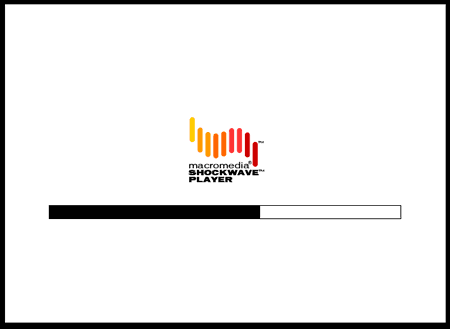
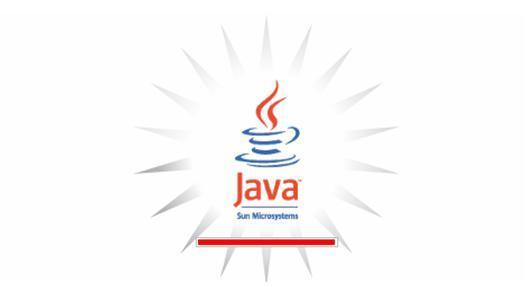
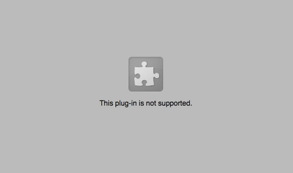
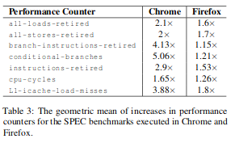

import { Split, Invert } from "mdx-deck/layouts";
import { Appear, Notes, Head } from "mdx-deck";

import "./preloader";

<Head>
  <title>WebAssembly – o que é e o que muda com ele</title>

<link rel="canonical" href="http://wasm-talk.netlify.com" />

  <meta name="twitter:card" content="summary_large_image" />
  <meta name="twitter:site" content="@vhfmag" />
  <meta
    property="twitter:image"
    content="https://wasm-talk.netlify.com/assets/card.png"
  />

<meta
  property="og:image"
  content="https://wasm-talk.netlify.com/assets/card.png"
/>
</Head>

<Head>
  
</Head>

## O que é e o que muda com ele

<small>wasm-talk.netlify.com</small>

---

export default Invert;

# O que é WebAssembly?

---

Uma linguagem nova da Web

<pre>
  <code>{`
(module
  (func $getAnswer (result i32)
    i32.const 42)
  (func (export "getAnswerPlus1") (result i32)
    call $getAnswer
    i32.const 1
    i32.add))
`}</code>
</pre>

<Appear>
  

    <small>
      <strike>(que eu espero que você não precise escrever na mão)</strike>
    </small>
  

</Appear>

---

# Por quê?

- Rápida
- Alvo de compilação
- Representação binária compacta

<Notes>
  <q>
    "Por quê? Por que mais uma linguagem na Web? O que falta em Javascript?"
  </q>
</Notes>

---

<small>Por quê?</small>

# Rápida

- Baixo nível
- Fortemente tipada
- Fácil de ser otimizada por compiladores
  - Performance <q>próxima de nativa</q>

---

<small>Por quê?</small>

# Alvo de compilação

- Traz novas linguagens pra Web
  - C, C++, C#, Rust (+ Go, Kotlin, Typescript [e outras](https://github.com/appcypher/awesome-wasm-langs))
- Integra com ferramentas como LLVM, dando acesso a inúmeras linguagens

---

<small>Por quê?</small>

# Representação binária compacta

- Parsear Javascript é custoso
  - 10 a 30% do tempo de carregamento de páginas ([fonte](https://medium.com/@addyosmani/the-cost-of-javascript-in-2018-7d8950fbb5d4))
  - [asm.js](https://asmjs.org/), sua precursora é rápida de executar, mas lento de parsear
- Já a representação binária de Wasm:
  - É mais compacta
  - É fácil de parsear
  - Pode ser executada _enquanto_ é baixada 🤯
  - É tão boa que [querem copiar no Javascript](https://github.com/tc39/proposal-binary-ast#faq)

---

export default Invert;

# ⚠ Disclaimer ⚠

## Cenas fortes a seguir

---

### Uma tecnologia que promete trazer performance nativa multiplataforma pro navegador, familiar? <big>🤔</big>

---

<Notes>
  Eu não consigo nem estimar quantas horas eu perdi nessa tela, esperando um
  jogo carregar no site do Cartoon Network
</Notes>

---

<Notes>
  Esse foi meu primeiro contato com a Web, então até que rola saudade, vai
</Notes>

---

---

# Por que é diferente?

Flash e Java applets:

- Eram uma catástrofe de segurança
  - Wasm foi feito com segurança em mente
- Mudavam constantemente, sem retrocompatibilidade
  - Wasm evolui de forma lenta e estável, como a Web!
- Não eram parte da Web
  - Seu site/app com Wasm vai continuar funcionando daqui a 10 anos

---

# Performance <q>próxima de nativa</q>?

  <small>
    Quanto menor, melhor (<a href="https://arxiv.org/abs/1901.09056">fonte</a>)
     
    <small>(e lembrem-se: diversidade de navegadores importa!)</small>
  </small>

