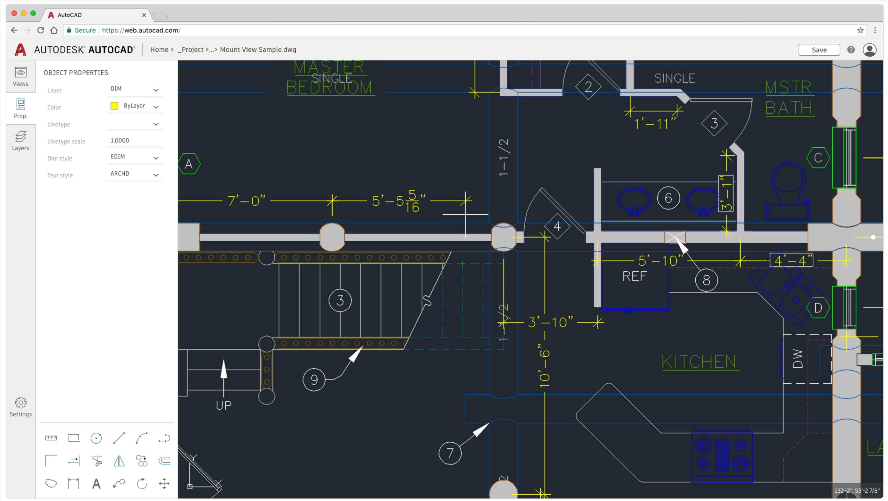
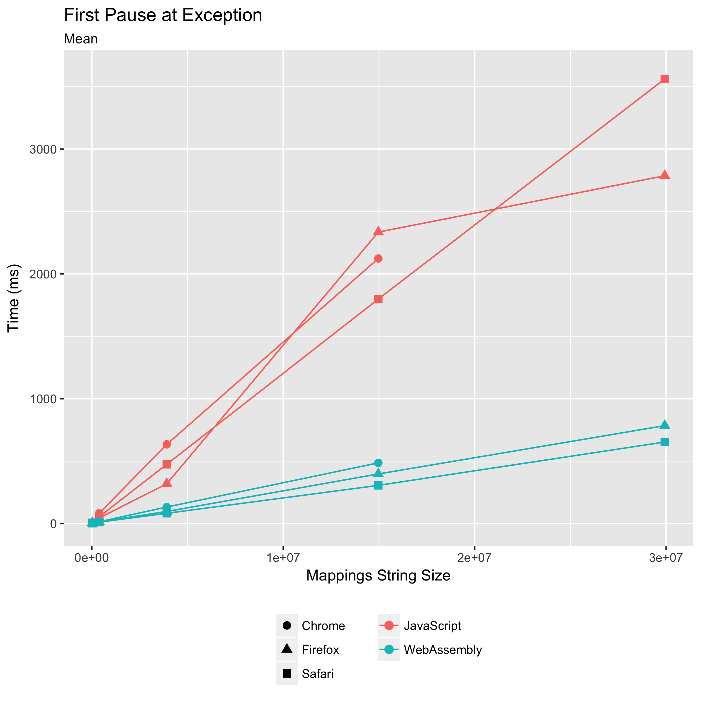
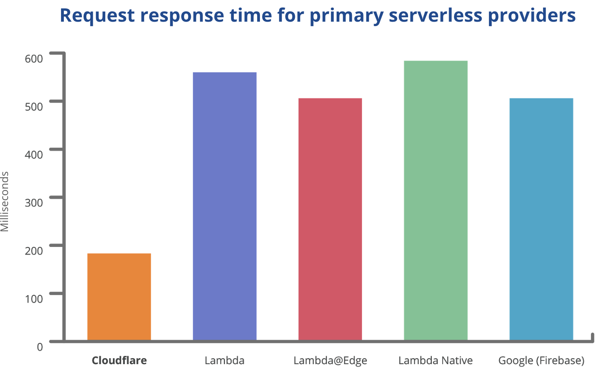
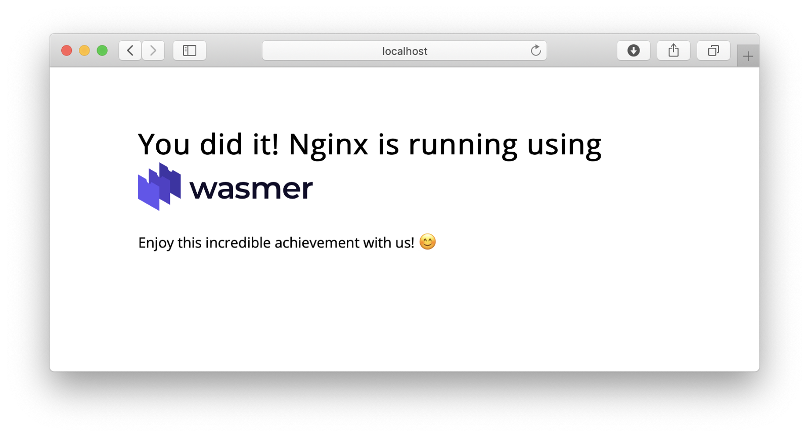

import { Split, Invert } from "mdx-deck/layouts";
import { Appear, Notes } from "mdx-deck";

export default Invert;

# O que muda com o WebAssembly

---

export default Invert;

# Parte 1: o que muda na Web

---

<small>O que muda na Web</small>

## Novas linguagens na Web

### Mais opções de linguagem e acesso a novas bibliotecas

<Notes>

Falar de portabilidade de código e acesso a bibliotecas e algoritmos implementadas em outras linguagens sem precisar reimplementar

</Notes>

---

<small>O que muda na Web > Novas linguagens</small>

[WebSight](https://github.com/Web-Sight/WebSight), demonstração de uso de [OpenCV](https://opencv.org/) compilado pra WebAssembly:

<Notes>

"Como veremos a seguir, isso também permite ter uma única base de código pra funcionalidades core e só reimplementar _a UI_"

</Notes>

---

<small>O que muda na Web</small>

## Apps desktop na Web

---

<small>O que muda na Web > Apps desktop</small>

## Autocad Web

---

<small>O que muda na Web > Apps desktop</small>

## Autocad Web

- Já usaram Flash e JS/HTML5, mas precisar reimplementar em JS/ActionScript o que já tinham em C++ era impeditivo
- Agora, com WebAssembly, as funcionalidades de base são implementadas uma única vez e disponibilizadas em todos os produtos

<small>
  <a href="https://youtu.be/BnYq7JapeDA">Pra saber mais, veja o vídeo</a>
</small>

---

<small>O que muda na Web</small>

## Polyfill de codecs

### Seu browser não suporta o último formato de vídeo 360? Vai ter um polyfill pra isso

---

<iframe
  style={{ width: "90vw", height: "90vh", maxWidth: 900 }}
  src="https://brionv.com/misc/ogv.js/demo2/#file=Caminandes_3_-_Llamigos_-_Blender_Animated_Short.webm&size=360p.av1.webm&source=av1&player=js"
/>

---

<small>O que muda na Web</small>

## Jogos

### A Unity já exporta seus jogos pra WebAssembly _hoje_!

---

<small>O que muda na Web > Caso de estudo da Unity com WebAssembly</small>

## Benchmark da Unity (_tempo até aparecer na tela_)

---

<small>O que muda na Web > Caso de estudo da Unity com WebAssembly</small>

## Benchmark da Unity (_tamanho de código_)

---

<small>O que muda na Web > Apps desktop</small>

## Outros casos de sucesso

- O Figma [também migrou seu web app de _asm.js_ para WebAssembly](https://www.figma.com/blog/webassembly-cut-figmas-load-time-by-3x/) e diminuiram o tempo de carregamento em **mais de 3x**
- O Google Earth voltou <strike>pra Web</strike> pro Chrome 🙄 [graças ao WebAssembly](https://medium.com/google-earth/earth-on-web-the-road-to-cross-browser-7338e0f46278)
- [O Chrome dá suporte a PWAs em todas as plataformas desktop](https://developers.google.com/web/progressive-web-apps/desktop), integrando web apps cada vez mais com elas 🎉

---

export default Invert;

# Parte 2: o que muda fora da Web

### <q>WebAssembly não é uma apenas uma forma de rodar código além de Javascript na Web; WebAssembly é uma pequena linguagem e fácil de incorporar que você pode usar em qualquer lugar</q> — [WebAssembly is more than the web](https://words.steveklabnik.com/webassembly-is-more-than-just-the-web)

---

<small>O que muda fora da Web</small>

## Runtimes JavaScript

### Node.js, Electron, Johnny-Five, React Native...

---

<small>Runtimes Javascript</small>

## Performance nativa no Node.js sem compilação

A Mozilla recentemente reimplementou parte de seu módulo [sourcemap-decoder](https://npm.im/sourcemap-decoder) em WebAssembly e [o tornou de 5 a 10x mais rápido](https://hacks.mozilla.org/2018/01/oxidizing-source-maps-with-rust-and-webassembly/):

---

<small>Runtimes Javascript</small>

## Performance nativa no Electron

[Finda](https://keminglabs.com/finda/), um app Electron para macOS, reporta [nesse post](https://keminglabs.com/blog/building-a-fast-electron-app-with-rust/) como ele usa Rust e WebAssembly para procurar por arquivos, abas abertas, histórico de navegador e muito mais em **menos de 1ms**

---

<small>O que muda fora da Web</small>

## Serverless

---

<small>O que muda fora da Web > Serverless</small>

## Cloudflare Workers

Cada worker é um _isolate_ dentro de um mesmo processo do V8, enquanto na maior parte dos FaaS cada worker é um container

---

<small>O que muda fora da Web > Serverless</small>

## Cloudflare Workers

Isso resolve tempo de resposta pra _cold starts_

---

<small>O que muda fora da Web > Serverless</small>

## Cloudflare Workers

- Cada novo processo do Node consome 35MB. Cada novo _isolate_, 3MB
- Elimina custo de _context switching_ do OS (~100ms)
- Só permitiria a execução de Javascript. Não mais, graças a WebAssembly

---

<small>O que muda fora da Web > Serverless</small>

## Olin

> <q>[Olin](https://github.com/Xe/olin) é (...) um primitivo radicalmente novo para tornar mais fácil raciocinar sobre, fazer deploy e operar serviços orientados a eventos e que seja independente (...) do computador em que ele esteja rodando.</q> — https://christine.website/blog/olin-1-why-09-1-2018

<!-- esse comentário é um hack pra separar os blockquotes sem ofender o prettier :( -->

> <q>Eu quero que este projeto dure décadas. Eu quero que os binários que eu suba hoje continuem funcionando daqui a 5 anos.</q> — https://github.com/Xe/olin

---

<small>O que muda fora da Web</small>

## Portabilidade

---

<small>O que muda fora da Web > Portabilidade</small>

## Wasmer

[wasmer](https://wasmer.io) é um projeto ambicioso que visa permitir a criação de binários universais, que podem ser [diretamente executados](https://medium.com/wasmer/running-webassembly-100x-faster-%EF%B8%8F-a8237e9a372d) ou [executados por um programa](https://medium.com/wasmer/running-webassembly-from-any-language-5741f6320ccd?source=collection_home---4------0---------------------), de qualquer plataforma

---

<small>O que muda fora da Web > Portabilidade</small>

## Wasmer

---

<small>O que muda fora da Web > Portabilidade</small>

## Wasmer

> A razão pra usar WebAssembly não é só velocidade, mas também portabilidade em qualquer arquitetura e isolamento de memória de cada processo.
>
> Esses são duas grandes inovações que vão ser a base da nova geração de computação na nuvem.
>
> — https://medium.com/@syrusakbary/hi-edward-d16345fb04b3

---

<small>O que muda fora da Web > Portabilidade</small>

## Outros

- [nebulet](https://github.com/nebulet/nebulet) — um sistema operacional que roda WebAssembly nativamente
- [WasmTime](https://github.com/CraneStation/wasmtime) — um _runtime_ de WebAssembly que implementa a [CloudABI](https://cloudabi.org), um POSIX perfeito pro WebAssembly

---

<small>O que muda fora da Web</small>

## Blockchain

---

<small>O que muda fora da Web > Blockchain</small>

## Ethereum

Hoje, o [Ethereum](https://www.ethereum.org/) implementa sua própria [linguagem de programação](https://solidity.readthedocs.io/en/v0.5.6/) e sua própria [máquina virtual](<https://github.com/ethereum/wiki/wiki/Ethereum-Virtual-Machine-(EVM)-Awesome-List#specification>).

A implementação não é ideal, e exige que cada vez mais algoritmos sejam pré-compilados e façam parte da VM em si.

---

<small>O que muda fora da Web > Blockchain</small>

## Ethereum

> Ao invés de usar a EVM, nós agora temos um conjunto eficiente de instruções, que tem garantias de ser executável e igualmente performático em diferentes tipos de plataformas.
>
> Não só dApps vão ficar mais rápidos em produção, como o desenvolvimento de _Smart Contracts_ vai se tornar mais acessível para pessoas já familiares com linguagens como Rust e Go.
>
> — https://medium.com/zkcapital/webassembly-the-future-of-blockchain-computing-1a0ae28f7e40

---

<small>O que muda fora da Web</small>

## Outros

- Você já pode usar WebAssembly até [em FPGAs](https://github.com/piranna/wasmachine)
