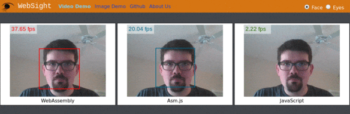
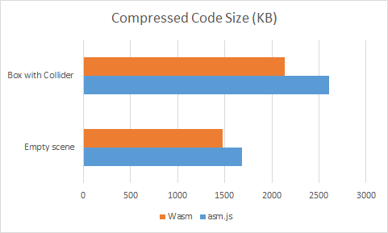

import { Split, Invert } from "mdx-deck/layouts";
import { Appear, Notes } from "mdx-deck";

export default Invert;

# O que muda com o WebAssembly

---

export default Invert;

# Parte 1: o que muda na Web

---

<small>O que muda na Web</small>

## Novas linguagens na Web

### Mais opções de linguagem e acesso a novas bibliotecas

---

[WebSight](https://github.com/Web-Sight/WebSight), demonstração de uso de [OpenCV](https://opencv.org/) compilado pra WebAssembly:

---

<small>O que muda na Web</small>

## Polyfill de codecs

### Seu browser não suporta o último formato de vídeo 360? Vai ter um polyfill pra isso

---

<small>O que muda na Web</small>

## Jogos

### A Unity já exporta seus jogos pra WebAssembly _hoje_!

---

<small>Caso de estudo da Unity com WebAssembly</small>

## Benchmark da Unity (_time to screen_)

---

<small>Caso de estudo da Unity com WebAssembly</small>

## Benchmark da Unity (_code size_)

---

<small>O que muda na Web</small>

## Apps desktop na Web

### Pesado demais ou precisa usar o mesmo código? Problema resolvido

<!-- ---

<small>O que muda na Web</small>

## Algoritmos pesados na Web

### ? -->

---

export default Invert;

# Parte 2: o que muda fora da Web
